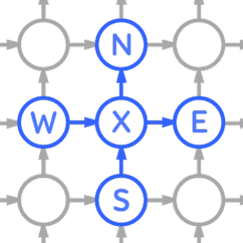
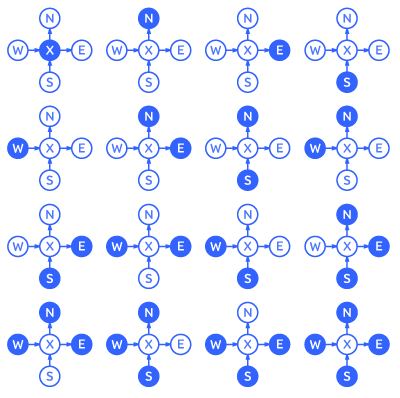
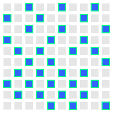
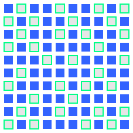
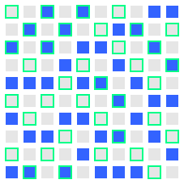
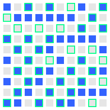

# Synthesis of Local Algorithms

## What is a Local Algorithm?
A _Distributed Algorithm_ is an algorithm which runs on a distributed system, that does not have a central coordinator.  
A _Local Algorithm_ is a Distributed algorithm that runs in constant time, independently of the size of the network.

## What kind of problems do these algorithms solve?
This research is focused on LCLs or locally checkable labeling problems on 2-dimensional torus grids in the LOCAL model of computation.  
 Examples of LCLs:
 * maximal independent set
 * maximal matching
 * vertex colouring
 * edge colouring

## About Algorithm Synthesis
The idea of the project is to use computer search to find new optimal local algorithms on 2-dimensional torus grids.

The basic structure of synthesized algorithm is the following:
1. Get specific normal form of the grid
2. Find right state for each vertex/edge base on constant size neighbourhood of vertex/edge

The goal of computer search is to find such normal form and radius of a neighbourhood so it is possible to find a mapping from a neighbourhood to right state for each vertex/edge.

## Vertex labeling problem  
 In this project I use computer search to find algorithms that produce binary vertex labels {0, 1}. Particularly, I study problems for which the feasibility of a solution can be verified by looking at 1-radius neighbourhood of each vertex.
 
 Consider following vertex _v_ on 2-dimensional torus grid:  
   
 It has 4 neighbours and it knows direction of north, east, west and south.  
 We can create a rule that specifies which vertices in the neighbourhood will have label 1. For example if rule is `NE` then neighbours on north and east will have label 1, vertex _v_ and neighbours on west and south will have label 0.
 
 A set of rules is a _problem_. For example following rules describe maximal independent set:  
 `X, N, E, S, W, NE, NS, NW, ES, EW, SW, NES, NEW, NSW, ESW, NESW`  
 It means that 1-radius neighbourhood of _any_ vertex must be one of the following combinations:  
 
 
 
Using normal form of grid and a SAT solver we can find a mapping from local neighbourhood to vertex label, so each vertex will belong to one of the rules described above:  
  
Green stroke indicated original independent set.  
This is not surprising because normal form for this problem is a maximal independent set of a grid.

Dominating set (1 x 1 tiles, 1 power)  


Column maximal independent set (5 x 2 tiles, 1 power)  


Column minimal dominating set (3 x 2 tiles, 1 power)  


XN XE NE XNE XS NS XNS ES XES NES XNES XW NW XNW EW XEW NEW XNEW SW XSW NSW XNSW ESW XESW  
(5 x 7 tiles, 3 power)  


## Build
```
# install sat solver:
sudo apt-get install minisat picosat

./gradlew jar
```
jar file will be placed in `build/libs` directory.

## Usage
Precalculate independent set tiles:
```
# calculate set of tiles:
java -cp algorithm-synthesis.jar com.github.kornilova_l.algorithm_synthesis.grid2D.independent_set.PrecalculateTilesKt <difficulty index>

# calculate specific tiles:
java -cp algorithm-synthesis.jar com.github.kornilova_l.algorithm_synthesis.grid2D.independent_set.PrecalculateTilesKt <n> <m> <k>

# precalculate graphs:
java -cp algorithm-synthesis.jar com.github.kornilova_l.algorithm_synthesis.grid2D.five_neighbours_problems.PrecalculateGraphsKt

# precalculate graphs with neighbourhoods of 4 tiles:
java -cp algorithm-synthesis.jar com.github.kornilova_l.algorithm_synthesis.grid2D.four_neighbours_problems.PrecalculateGraphsKt
```
